## Fitur & Hasil API (Screen Capture)

Berikut merupakan detail dari fitur yang berjalan di sistem dan dokumentasi hasil uji API dari Postman sesuai instruksi pengerjaan:

### 1. Modul Users 
Handling *business logic* untuk operasi User (Soft delete, auto hashing password, Unique Email constraint).

* **POST `/users` (Create User)**
  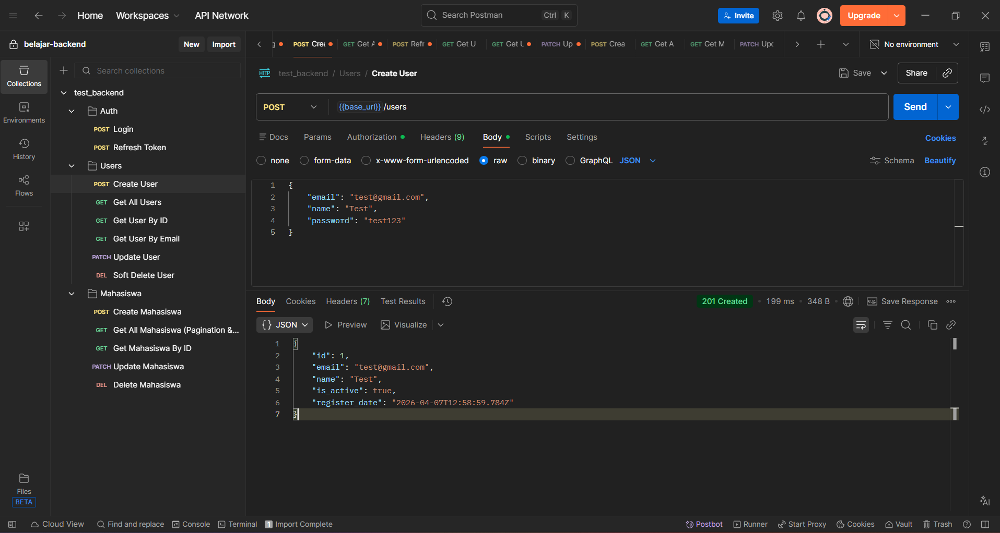
  
* **GET `/users` (All Users)**
  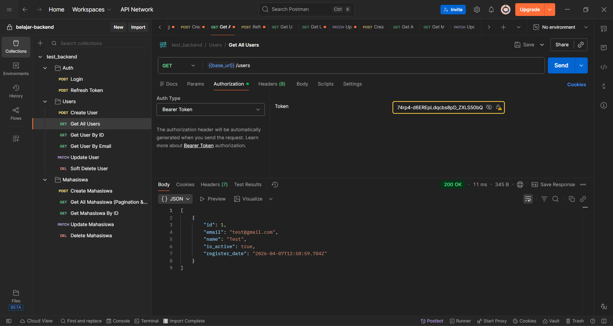

* **GET `/users/:id` (User by ID)**
  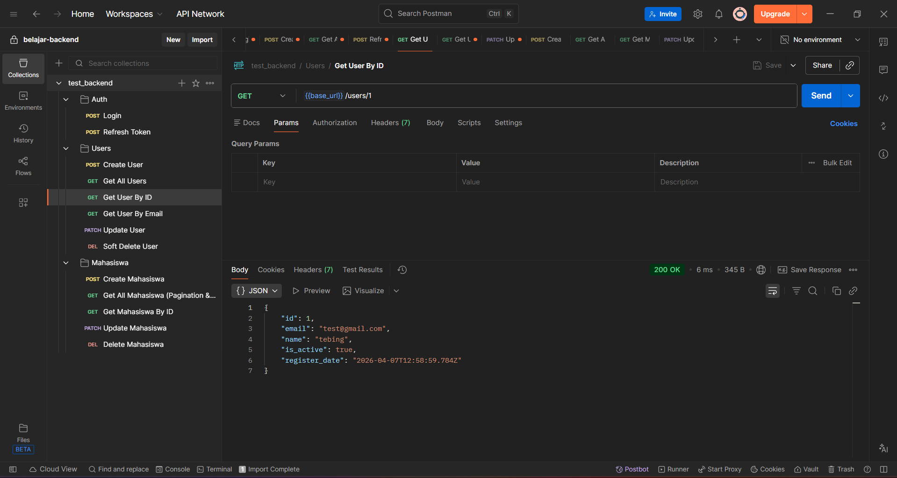

* **GET `/users/email/:email` (User by Email)**
  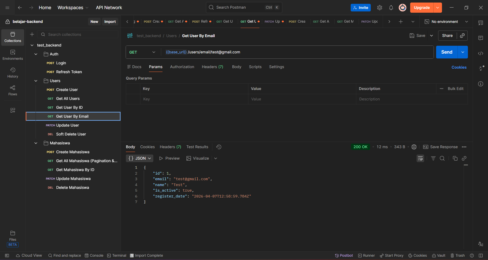

* **PATCH/PUT `/users/:id` (Update User Name)**
  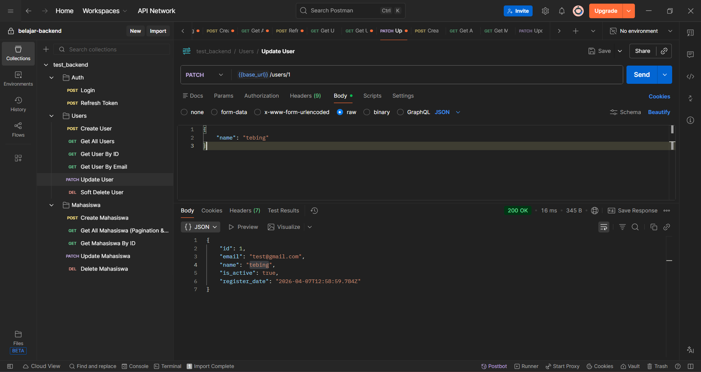

* **DELETE `/users/:id` (Soft-Delete User)**
  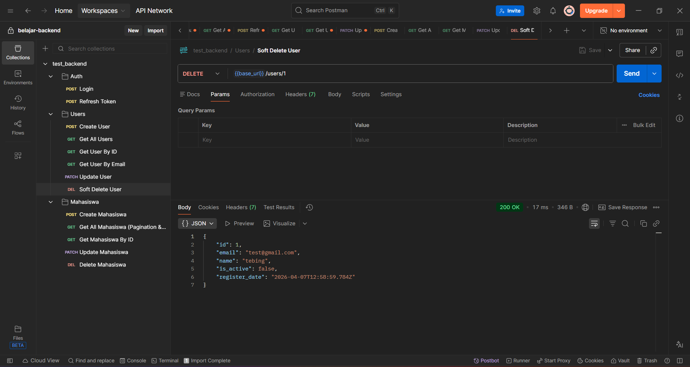

---

### 2. Modul Autentikasi (Login & JWT)
Sistem proteksi aplikasi API dengan Token.

* **POST `/auth/login` (Login & Access Token)**
  *(Token dikembalikan setelah validasi payload `email` & `password`)*
  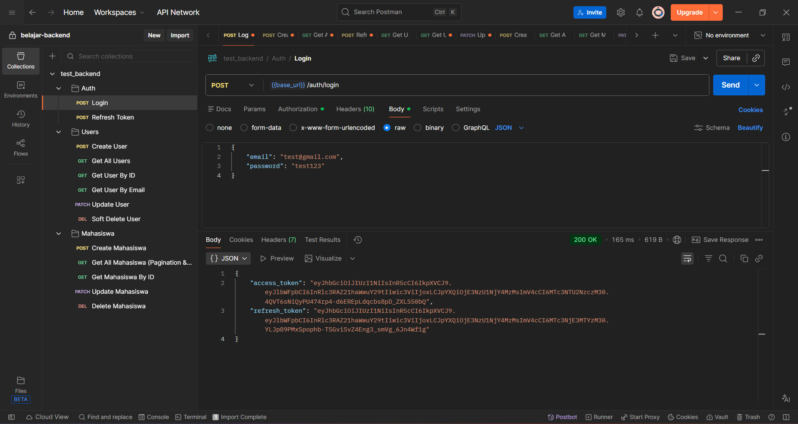

* **Refresh Token Mechanism**
  *(Sistem memperbarui token di atas durasi 15 menit)*
  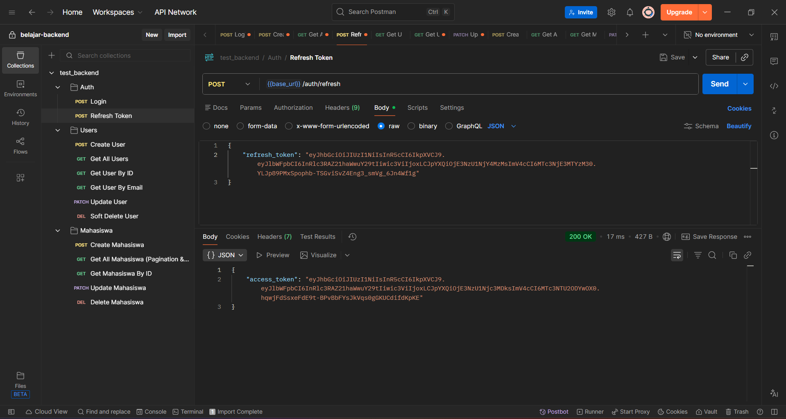

---

### 3. Modul Mahasiswa
Sistem CRUD (Create, Read, Update, Delete) entitas `data_mhs` dengan constraint Unique Mahasiswa, Pagination, dan Dynamic Search.

* **POST `/mahasiswa` (Create Data Mahasiswa)**
  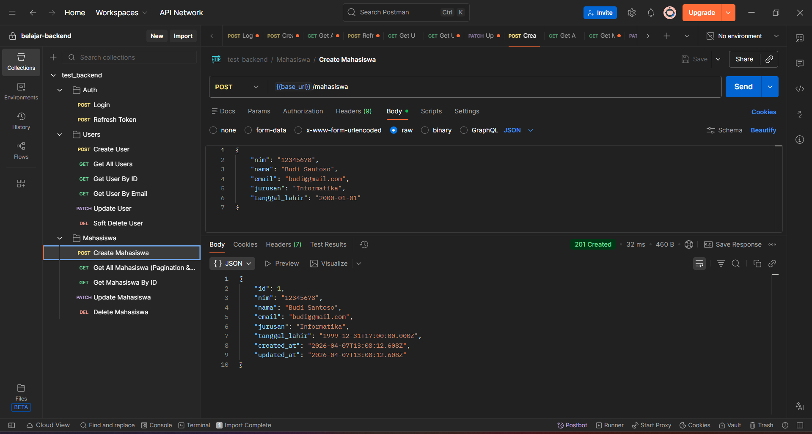

* **GET `/mahasiswa` (List Semua Data & Pagination + Dynamic Query)**
  *(Melakukan testing filter data API dengan request query tertentu misal `email` / `nim`)*
  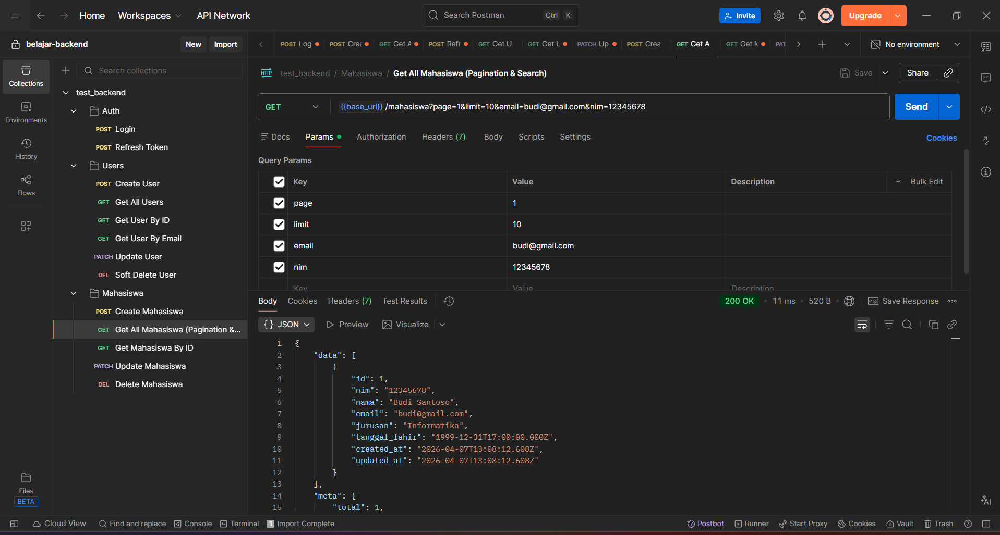

* **GET `/mahasiswa/:id` (Read Data Mahasiswa - By ID)**
  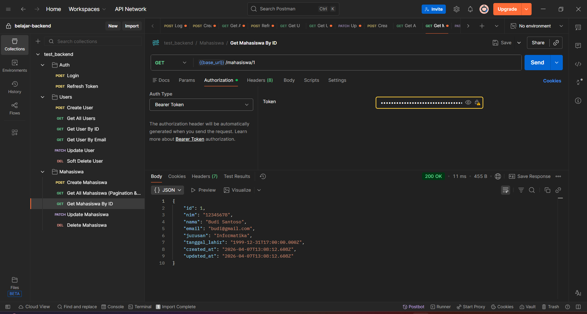

* **PATCH/PUT `/mahasiswa/:id` (Update Informasi Mahasiswa)**
  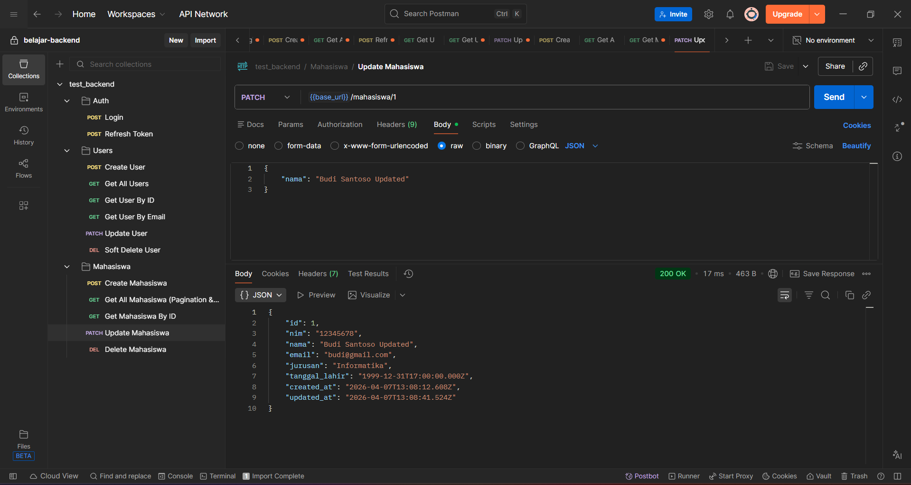

* **DELETE `/mahasiswa/:id` (Hapus Data Mahasiswa)**
  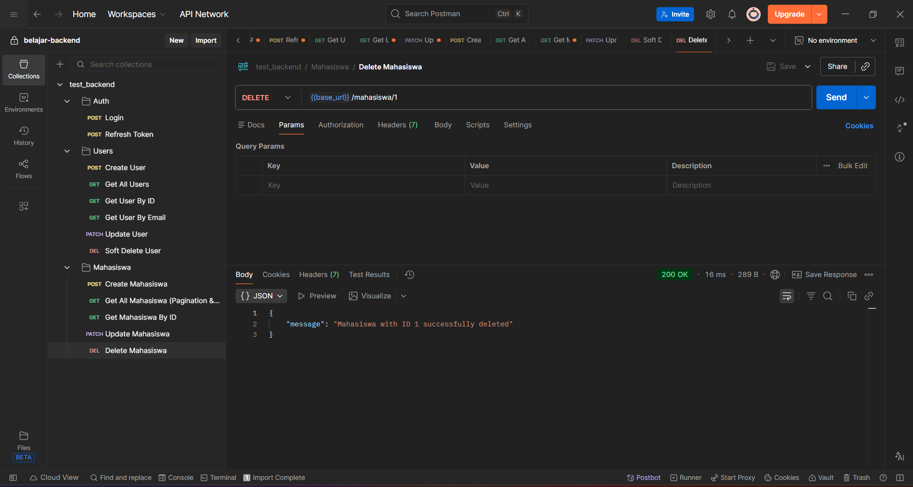